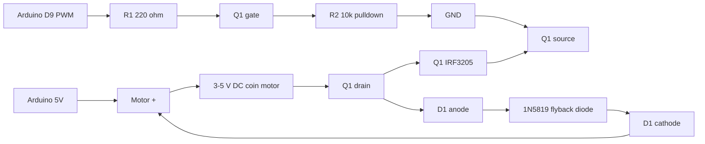

# Human-Readable Circuit Diagram

## Wiring

```text
Arduino UNO R4 WiFi

D9 PWM ----[R1 220R]---- Gate  Q1 IRF3205
                         |
                       [R2 10k]
                         |
GND ---------------------+---- Source Q1

5V ---- M1 motor +
M1 motor - ---- Drain Q1

D1 1N5819 across M1:
Cathode / marked end -> 5V / motor +
Anode                 -> Q1 drain / motor -
```

## Mermaid Overview



## Practical Assembly Checklist

- Keep the Arduino ground and MOSFET source ground common.
- Put the diode physically close to the motor if possible.
- Keep motor wires short for the first test.
- Start with a lower PWM value, for example `intensity=120`, before testing full power.

