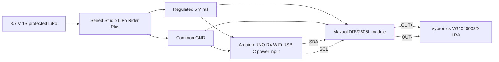

# Human-Readable Circuit Diagram

## Wiring

```text
3.7 V 1S protected LiPo
        |
        v
Seeed Studio LiPo Rider Plus
        |
        +---- 5V ---- Arduino UNO R4 WiFi USB-C power input
        |             DRV2605L VIN/VCC
        |
        +---- GND --- Arduino GND
                      DRV2605L GND

Arduino UNO R4 WiFi SDA ---- DRV2605L SDA
Arduino UNO R4 WiFi SCL ---- DRV2605L SCL

DRV2605L OUT+ ---- Vybronics VG1040003D lead 1
DRV2605L OUT- ---- Vybronics VG1040003D lead 2
```

## Mermaid Overview



## Practical Assembly Checklist

- Confirm LiPo Rider Plus output is switched on before testing.
- Confirm Arduino and DRV2605L share ground.
- Confirm the DRV2605L module is detected over I2C before connecting the actuator for extended tests.
- Start with short effects and adjust the DRV2605L library/effect mapping after feeling the actuator response.
