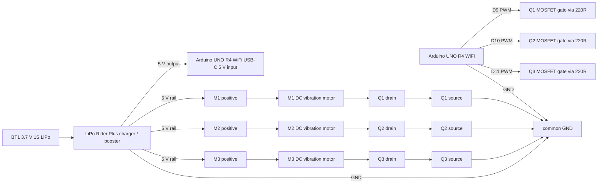

# haptell-04 Triple DC Motor Wiring

Each motor is wired like the haptell-01 DC motor prototype. The only difference
is that haptell-04 has three independent MOSFET-switched motor channels.

Add one 10k pulldown from each MOSFET gate to GND. Add one 1N5819 diode across
each motor with the cathode on the 5 V side and the anode on the MOSFET drain
side.
