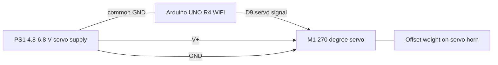

# haptell-05 Wiring Diagram

The Arduino sends a servo control pulse on `D9`. The servo power path is
separate from the Arduino logic power path, but both grounds must be connected.



## Signal and Power

```text
Arduino D9 -> servo signal lead
servo supply + -> servo V+
servo supply GND -> servo GND
servo supply GND -> Arduino GND
Arduino USB-C -> Arduino power
```

Do not connect the servo V+ lead to the Arduino 5 V pin. The servo stall
current is too high for the Arduino board power path.

## Pulse Mapping

```text
500 us  -> 0 deg
1500 us -> 135 deg
2500 us -> 270 deg
```
